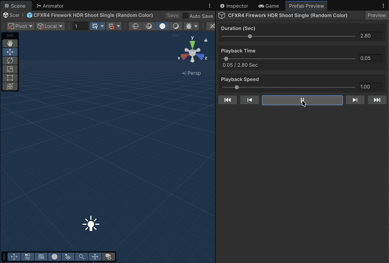

# PrefabPreview

PrefabPreview is a Unity Editor extension that allows you to preview prefabs directly in the Editor — including Animator, ParticleSystem, and AudioSource without entering Play Mode.
Perfect for checking UI animations and visual effects during development.

---

## ✨ Features

- 🧩 Preview any **Prefab** in a dedicated **Editor Window**
- 🎞️ Supports **Animator** playback
- 💨 Simulates **Particle Systems** in sync
- 🔊 Plays **AudioSource** components in real-time

---

## 📦 Installation
Git Path (Unity Package Manager)
> https://github.com/kurobon-jp/PrefabPreview.git?path=Assets/

---

## 🧭 Usage

1. Open the window:  
   **Window → Prefab Preview**
2. Enter prefab edit mode.
3. Press the **Play Preview** button to start synchronized playback.

---

